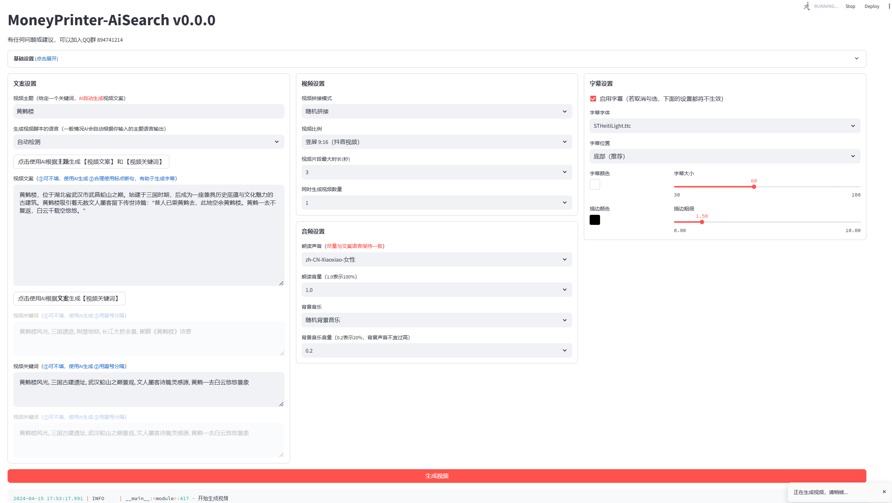

<div align="center">
<h1 align="center">MoneyPrinter-AiSearch 💸</h1>
</div>
  
## 👋 简介
大模型以及多模态模型驱动的自动短视频生成器：只需提供一个视频主题或关键词，文案/素材/字幕都完全由AI自动检索或生成，最终合成短视频
<br>
### 主要特点：
- AI素材精准搜索，和文案匹配度更高
### 界面

### 生成视频Demo
<table>
<thead>
<tr>
<th align="center"><g-emoji class="g-emoji" alias="arrow_forward">▶️</g-emoji> 《黄鹤楼》</th>
</tr>
</thead>
<tbody>
<tr>
<td align="center"><video src="https://github.com/MingxiLi/MoneyPrinter-AiSearch/assets/32333706/5bc12d4c-346d-421d-beb0-358ee372b2f8"></video></td>
</tr>
</tbody>
</table>

## 🗞️ 更新内容
- [x] 更新<b>AI素材搜索</b>功能
  - [x] 提升了素材和文案的匹配度（Pexels自带搜索功能不准确）
  - [x] 更新了中文AI搜索模型和相关数据库，支持Pexels上面近40w视频检索

## 📅 后期计划 
很多要优化的...，有需求大家可以提issue或者联系我。这个项目现在很好玩，但是不太好用
- [ ] 重构素材组织形式
- [ ] 支持使用和搜索本地素材
- [ ] 提升AI文案质量和视频生成质量

## 💬 交流反馈
 

## 📥 安装部署
1. 下载git文件
```shell
git clone https://github.com/MingxiLi/MoneyPrinter-AiSearch.git
```
2. 下载素材检索模型及数据库，地址在百度网盘
```shell
链接：https://pan.baidu.com/s/1fZTFYu5Oj9KKHP0kTyeudQ?pwd=my5w 
提取码：my5w
```
3. 将解压后的'database'和'nn_models'两个文件夹，放到'resource'文件夹内
4. 点击目录下的'run.bat'文件，首次运行会自动下载配置环境
5. LLM的api以及ImageMagick可以参考 https://github.com/harry0703/MoneyPrinterTurbo 。<b>推荐使用国内的LLM（例如通义千问），因为素材库下载素材不需要VPN，使用VPN反倒可能导致下载失败</b>

## 📚 参考项目 
该项目基于以下两个项目，加入了更多AI功能，提升生成视频的质量。非常感谢两个项目的作者！！！
- https://github.com/FujiwaraChoki/MoneyPrinter
- https://github.com/harry0703/MoneyPrinterTurbo

## 📝 许可

点击查看 [`LICENSE`](LICENSE) 文件
